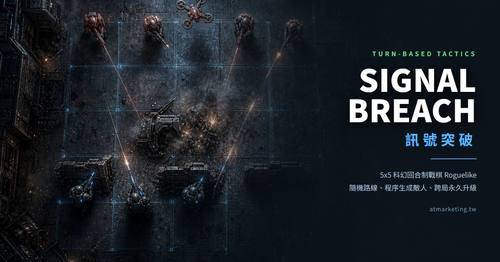

# Signal Breach 訊號突破

5x5 網格的科幻回合制戰棋 Roguelike。純前端、零執行期依賴、不需要 build。

**▶ 立即遊玩：https://atm301.github.io/signal-breach/**



---

## 這是什麼

一次出擊要打穿 12 層。路線是隨機分岔的，敵人配置、掩體佈局、事件與商品全部程序生成。
死了就從頭來，但賺到的核心碎片會留下來換永久升級。

- **戰鬥**：5x5 網格，三人小隊，回合制
- **核心規則**：AP 只用來移動，**攻擊每回合限一次**
- **掩體**：對距離 2 格以上的攻擊減傷
- **路線**：交火 / 精英 / 事件 / 補給 / 黑市 / 頭目，六種節點分岔推進
- **成長**：升級抽卡三選一、兩條技能樹路線、跨局永久升級
- **種子**：`?seed=任意文字` 可重現同一場；`?daily=1` 是每日挑戰
- **存檔**：出擊進度每次移動都自動存，關掉分頁回來可以從開場畫面接續

存檔在瀏覽器 localStorage，關掉分頁不會消失。

## 操作

| 鍵 | 功能 |
|---|---|
| 點自己的單位 | 選定 |
| `M` | 移動模式 |
| `A` | 攻擊模式 |
| `E` | 結束回合 |
| `Tab` | 循環切換單位 |
| `1` `2` `3` | 抽卡時直接選 |
| `S` / `B` | 音效開關 / 音樂開關 |
| `F` | 全螢幕 |

## 本機執行

ES module 不能走 `file://`，需要一個 http 伺服器：

```bash
npm run dev     # http://localhost:5178
```

## 開發

```bash
npm run sim            # 玩法評估器：跑 300 場，輸出勝率／深度分佈／回合長度
npm test               # Playwright 整合測試（20 項斷言 + console error 檢查）
npm run shots          # 各畫面截圖，人眼驗證用
npm run assets         # 重切 AI 素材 + 重做 OG 圖
```

`npm run sim` 是這個專案最重要的工具。單元測試只能證明程式沒壞，
證明不了遊戲好不好玩 —— 平衡數值全部是靠它跑幾千場調出來的，
理由與實測數字寫在 [BALANCE.md](BALANCE.md)。

架構與開發規範見 [CLAUDE.md](CLAUDE.md)。

## 技術

- 純 JavaScript ES module，無框架、無 build step、無執行期依賴
- 遊戲邏輯（`src/engine.js`）完全不碰 DOM，所以模擬器能在 node 裡直接跑
- 美術是 gpt-image-1 生成，走「一張大表 → 程式切圖」流程（`tools/slice-sheets.mjs`）
- 33 個單位素材 = 11 個單位 × 完好／受損／重創三個損傷階段
- 音效與背景音樂全部用 Web Audio 即時合成，沒有任何音檔
- 5 首 BGM 隨機播放，依畫面切換強度（大廳 / 地圖 / 戰鬥 / 頭目），進戰鬥會自動換曲

## 授權

程式碼與美術素材版權為作者所有。

作者：何佳勳 · [atmarketing.tw](https://atmarketing.tw)
